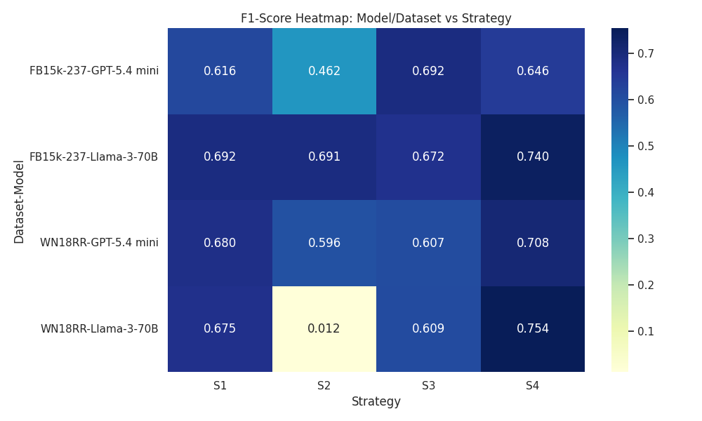
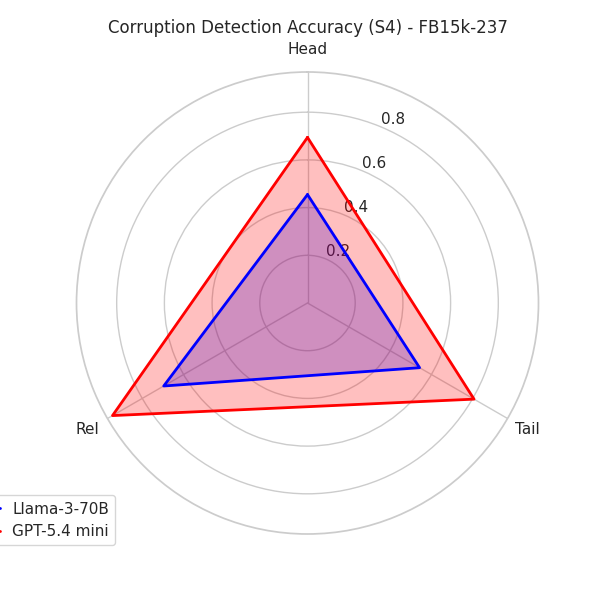
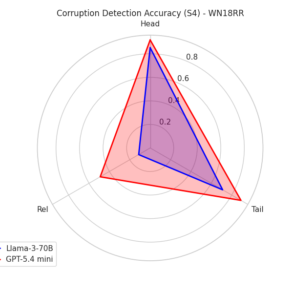
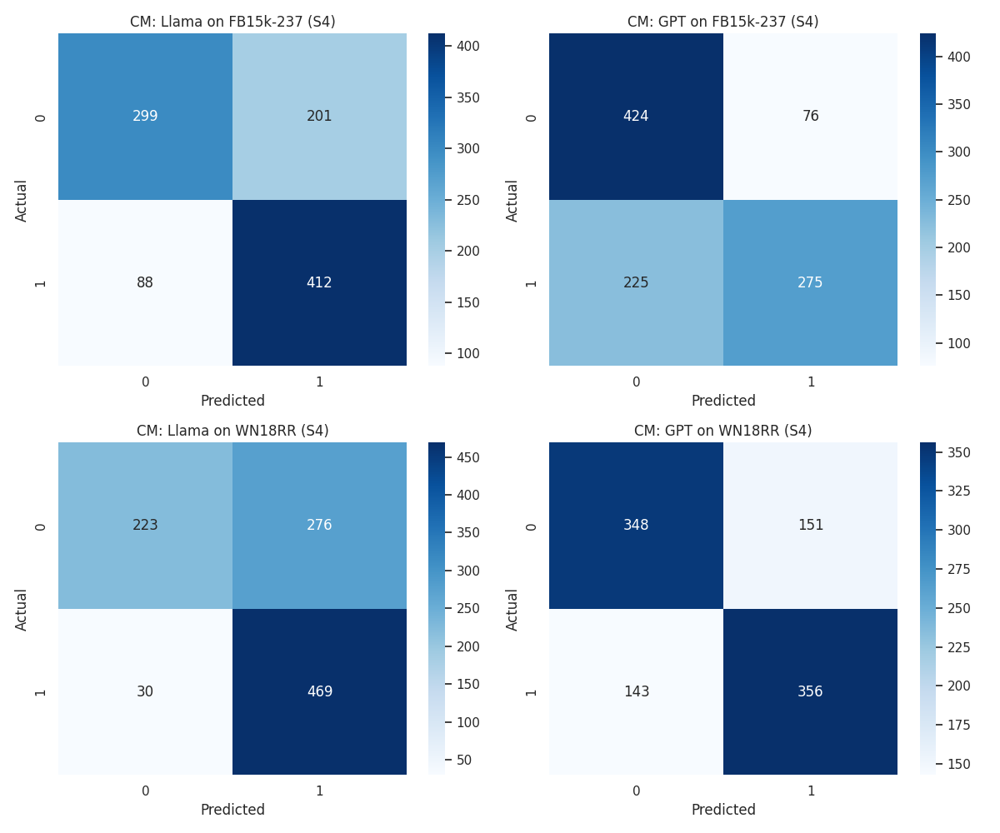

# LLM-Enhanced Knowledge Graph Quality Evaluation
### Comparative Study on FB15k-237 and WN18RR

This repository contains the source code, datasets, and experimental configurations for evaluating the capability of Large Language Models (LLMs) to validate and refine Knowledge Graphs (KGs). We benchmark **Llama-3-70B** (self-hosted, vLLM on HPC) and **GPT-5.4 mini** (API) as knowledge-graph judges across four prompting strategies on two benchmark datasets: **FB15k-237** (real-world facts) and **WN18RR** (lexical semantics).

📄 **[Read the full report (IEEE format)](docs/report.pdf)**

## Key Contributions
* **Relation-Aware Corruption Engine:** A custom pipeline to generate semantically plausible "type-safe" negative samples.
* **Multi-Strategy Prompting:** Evaluation across four strategies (S1–S4): Zero-Shot, Few-Shot, Chain-of-Thought, and **Expert Persona**.
* **Failure Taxonomy:** A classification of LLM errors including Ontological Over-Generalization, Plausibility Traps, Structural Skepticism, and Semantic Ambiguity.
* **Topological Analysis:** Measuring how LLM-driven graph pruning reshapes network density and connectivity to mitigate "embedding pollution."

## Key Results

| Dataset | Best Configuration | Accuracy | Precision | Recall | F1 |
|---|---|---|---|---|---|
| FB15k-237 | Llama-3-70B · Expert Persona (S4) | 71.1% | 67.2% | 82.4% | **0.740** |
| FB15k-237 | GPT-5.4 mini · Chain-of-Thought (S3) | 67.8% | 66.3% | 72.2% | 0.692 |
| WN18RR | Llama-3-70B · Expert Persona (S4) | 69.3% | 63.0% | 93.9% | **0.754** |
| WN18RR | GPT-5.4 mini · Expert Persona (S4) | 70.5% | 70.2% | 71.3% | 0.708 |



**The headline finding: the two models fail in opposite directions.** Llama-3-70B wins on F1 — driven by near-exhaustive recall of true facts (93.9% on WN18RR) — but exhibits an *affirmation bias*, accepting corrupted triplets that look plausible. GPT-5.4 mini behaves as a skeptical high-precision filter: it catches far more corruptions (49.1% vs 11.2% on WordNet relation swaps) at the cost of rejecting true facts. Neither model is strictly "better" — they embody a recall/precision trade-off with different implications for KG maintenance.

### Robustness by corruption type (S4)

Detection accuracy across Head, Tail, and Relation corruptions — GPT-5.4 mini (red) dominates every axis, most dramatically on WN18RR relation swaps, where Llama-3-70B nearly collapses:

| FB15k-237 | WN18RR |
|---|---|
|  |  |

### Other notable findings

* **Few-shot divergence:** Few-shot prompting (S2) was catastrophic for Llama-3-70B on WN18RR (F1: **0.012**) — the model began rejecting almost every triplet — while GPT-5.4 mini used the same examples to stabilize its predictions.
* **Expert Persona synergy:** Assigning a "Knowledge Graph Engineer" persona was the single most effective intervention for Llama-3-70B, lifting F1 from 0.67 (zero-shot baseline) to 0.75.
* **Topological impact:** GPT-5.4 mini's aggressive filtering collapsed FB15k-237 to 238 connected components, concentrating the graph into well-supported factual hubs — quantifying the structural cost of high-precision pruning.

<details>
<summary><b>Confusion matrices (S4, both models × both datasets)</b></summary>



Llama's error mass sits in false positives (affirmation bias); GPT's sits in false negatives (skepticism).
</details>

## Repository Structure
```text
├── data/                   # Raw input (.tsv, .txt) and intermediate (.csv) data
├── docs/
│   └── report.pdf          # Full project report (IEEE format)
├── scripts/                # Python processing and evaluation logic
│   ├── sampling.py         # Pre-processing and Stratified sampling (N=500)
│   ├── network_analysis.py # Initial topological summary and visualization
│   ├── corruption.py       # Relation-aware triplet corruption (Type-safe)
│   ├── mapping.py          # ID-to-Text natural language mapping
│   ├── llama_inference.py  # Llama-3-70B vLLM inference logic
│   ├── gpt_inference.py    # GPT-5.4-mini API inference logic
│   └── plots.py            # Result visualization (Heatmaps, Radar charts)
├── slurm/                  # Batch script for LARCC HPC execution
│   └── llama_inf.slurm     # GPU cluster submission script
├── results/                # Output logs, CSV results, and final plots
│   └── figures/            # Figures embedded in this README
├── run_gpt.sh              # Local execution wrapper (macOS/Linux)
├── run_gpt.bat             # Local execution wrapper (Windows)
├── requirements.txt        # Python dependency list
└── README.md               # Project documentation
```

## Setup & Installation
1. Clone the repository:
   
   ```bash
   git clone https://github.com/alizainkaimkhan/llm-based-knowledge-graph-eval.git
   cd llm-based-knowledge-graph-eval
   ```
   
2. Install dependencies:
   
   ```bash
   pip install -r requirements.txt
   ```
   
## How to Run

### 1. Data Preparation Pipeline
Run these scripts from the project root to generate the evaluation set in `data/`:

```bash
python scripts/sampling.py
python scripts/corruption.py
python scripts/mapping.py
```

### 2. LLM Inference
#### **Remote Execution (LARCC Cluster)**
Submit `llama_inf.slurm` to the GPU partition for Llama-3-70B inference:

```bash
sbatch slurm/llama_inf.slurm
```

#### **Local Execution (macOS / Linux / Windows)**
Use the wrapper scripts `run_gpt.sh` (macOS/Linux) or `run_gpt.bat` (Windows) for GPT-5.4-mini inference. **Note:** Export `OPENAI_API_KEY` in your shell before running.

**macOS/Linux:**

```bash
export OPENAI_API_KEY="..."
chmod +x run_gpt.sh
./run_gpt.sh
```

**Windows (Command Prompt):**

```bat
set OPENAI_API_KEY=...
run_gpt.bat
```

### 3. Analysis & Visualization
Run `plots.py` to generate the final F1-score heatmaps, radar charts and confusion matrices in `results/`:

```bash
python scripts/plots.py
```

## Future Work
* **Supervised Fine-Tuning (SFT):** Training models specifically for graph-judgment tasks.
* **Agentic Multi-Model Consensus:** Collaborative auditing between Llama and GPT.
* **Knowledge Graph of Thoughts (KGoT):** Externalizing LLM reasoning into dynamic graph structures.
* **Interactive Refinement:** Human-in-the-loop safeguards and semantic filtering.

## Contributors & Affiliation
* **Ali Zain Kaimkhani**
* **Rafia Fayyaz**
* **Zeeshan Akram**
* **Course:** CSE 694: Deep Learning on Graphs — Spring 2026, University of Louisville

## Acknowledgments
The authors acknowledge the **Louisville Academic Research Compute Cluster (LARCC)** at the University of Louisville for providing the computational resources used in this research. This work was made possible, in part, by the Advanced Computing Core at the University of Louisville.